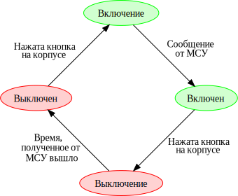
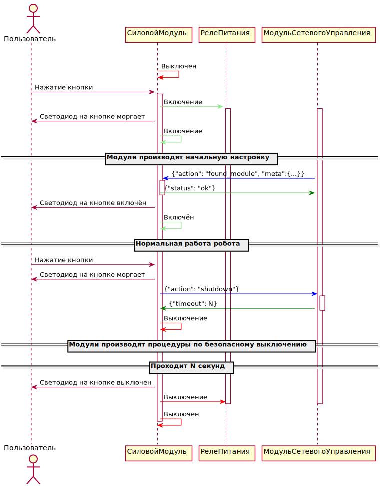

# УПММР
## Управление питанием в модульном мобильном роботе

Этот документ рассказывает об алгоритме управления питанием в модульном мобильном роботе, а именно о взаимодействиях между силовым модулем (СМ) и модулем сетевого управления (МСУ).

* Имя: 3/УПММР
* Статус: заготовка (raw)
* Редактор: Плетенев Павел Филиппович <<cpp.create@gmail.com>>.
* Соавторы: Андреев Виктор Павлович <<andreevvipa@yandex.ru>>, Ким Валерий Леонидович <<top7733@gmail.com>>

### Лицензия

Copyright (c) 2017 Редактор и Соавторы.

This Specification is free software; you can redistribute it and/or modify it under the terms of the GNU General Public License as published by the Free Software Foundation; either version 3 of the License, or (at your option) any later version.

This Specification is distributed in the hope that it will be useful, but WITHOUT ANY WARRANTY; without even the implied warranty of MERCHANTABILITY or FITNESS FOR A PARTICULAR PURPOSE. See the GNU General Public License for more details.

You should have received a copy of the GNU General Public License along with this program; if not, see <http://www.gnu.org/licenses>.

### Преамбула
Это открытая спецификация, она создаётся и управляется на основе перевода спецификации Консенсус-Ориентированной Системы Спецификации ([digistan.org/1/КОСС](digistan.org/1/КОСС)) организации Digital Standards Organization.

Термины "ДОЛЖНО", "ДОЛЖНА", "ДОЛЖНЫ", "ДОЛЖЕН", "ОБЯЗАТЕЛЬНЫЙ", "ОБЯЗАТЕЛЬНО" (MUST, REQUIRED, SHALL), "НЕ ДОЛЖЕН", НЕ ДОЛЖНА", "НЕ ДОЛЖНЫ" (MUST NOT, SHALL NOT), "РЕКОМЕНДОВАНО" (SHOULD, RECOMMENDED), "НЕ РЕКОМЕНДОВАНО" (SHOULD NOT, NOT RECOMMENDED), "МОГУТ", "МОЖЕТ" (MAY, OPTIONAL) в рамках этого документа ДОЛЖНЫ интерпретироваться в соответствии с RFC 2119[REFERENCES].

В документе используются определения и понятия из спецификации [1/ПММВ](/1/ПММВ/).

### Цель документа

УПММР рассказывает об основных функциях и системе команд силового модуля(СМ), алгоритмах реализации системы команд и о реализации принципов распределённого питания модулей для гетерогенного модульного мобильного робота (МР).

### Силовой модуль

Силовой модуль должен иметь на борту источник электроэнергии и выдавать электроэнергию в разъёмы питания механических интерфейсов.

Напряжение, подаваемое СМ в другие модули должно быть единым с другими модулями, входящим  комплект модульного МР. Ток, подаваемый СМ, должен быть постоянным и достаточным для питания всех модулей. СМ должен реализовывать функции амерметра и вольметра, и, наблюдая за из показаниями, выявлять критические для источника питания режимы работы. О таких режимах модуль должен сообщать через асинхронный интерфейс. Через синхронный интерфейс модуль должен выдавать текущие показания вольтметра и амперметра.

Пользователь силового модуля должен иметь возможность включения и выключения робота без вреда для систем управления всех модулей. Т.к. подавляющее большинство модулей при подаче питания включаются автоматически, то необходимо контролировать только выключение питания. Алгоритм контроля выключения см. далее.

Модуль реализует команды метинтерфейса.

### Алгоритм безопасного отключения питания
На корпусе силового модуля должна быть установлена одна физическая кнопка со светодидом.

Алгоритм предполагает 4 состояния в которых может находится силовой модуль:

1. Включение - питание на отдельные модули подано, модули производят начальную настройку.
2. Включен - питание на отдельные модули подано, нормальная работа модульного МР.
3. Выключение - питание на отдельные модули подано, модули производят процедуры по безопасному выключению.
4. Выключен - питание на отдельные модули отключено.

* Если робот находился в состоянии "выключен", то однократное нажатие на кнопку на корпусе силового модуля приводит к подаче питания с силового модуля на остальные модули и на управляющую плату силового модуля, силовой модуль переходит в состояние "включение"
* Если робот находился в состоянии "включение", то при получении на метаинтерфейсе силового модуля команды "found_module" с метаинформацией о МСУ силовой модуль переходит в состояние "включен".
* Если робот находился в состоянии "включен", то однократное нажатие на эту кнпоку приводит к передаче сообщения о выключении робота с силового модуля на модуль сетевого управления. Робот переходит в состояние "выключение". При этом модуль сетевого управления в ответном сообщении указывает силовому модулю период времени, по прошествии которого можно будет безопасно отключить питание.
* Если робот находился в состоянии "выключение" и проходит время, отведённое МСУ на выключение, то силовой модуль отключает подачу питания на остальные модули и на управляющую плату силового модуля.

